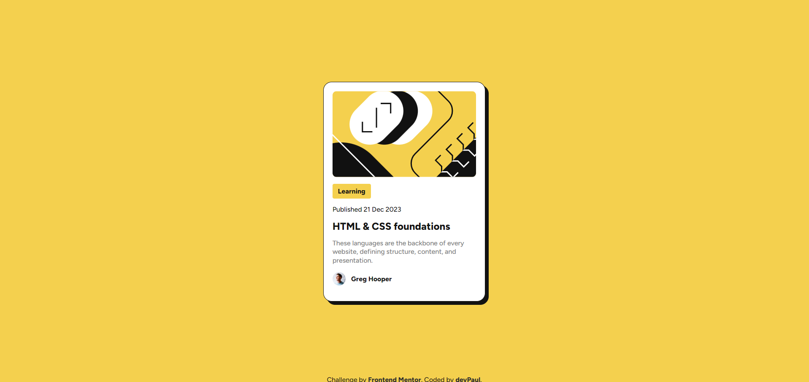

# Frontend Mentor - Blog preview card solution

This is a solution to the [Blog preview card challenge on Frontend Mentor](https://www.frontendmentor.io/challenges/blog-preview-card-ckPaj01IcS). Frontend Mentor challenges help you improve your coding skills by building realistic projects. 

## Overview

### The challenge

Users should be able to:

- See hover and focus states for all interactive elements on the page

### Screenshot

### Links

- Solution URL: [https://www.frontendmentor.io/solutions/frontend-mentor---blog-preview-card-solution-5k0sRwE92i](https://www.frontendmentor.io/solutions/frontend-mentor---blog-preview-card-solution-5k0sRwE92i)
- Live Site URL: [https://dev-paull.github.io/blog-preview-card/](https://dev-paull.github.io/blog-preview-card/)

### Built with

- Semantic HTML5 markup
- CSS custom properties
- Flexbox
- Mobile-first workflow
